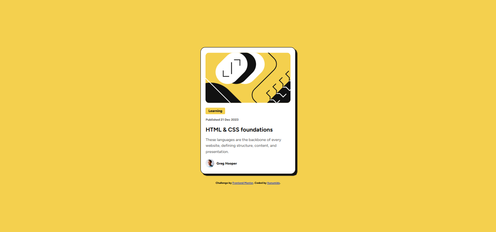

# Frontend Mentor - Blog preview card solution

This is a solution to the [Blog preview card challenge on Frontend Mentor](https://www.frontendmentor.io/challenges/blog-preview-card-ckPaj01IcS). Frontend Mentor challenges help you improve your coding skills by building realistic projects.

## Table of contents

- [Overview](#overview)
  - [The challenge](#the-challenge)
  - [Screenshot](#screenshot)
  - [Links](#links)
- [My process](#my-process)
  - [Built with](#built-with)
  - [What I learned](#what-i-learned)
  - [Continued development](#continued-development)
- [Author](#author)
- [Acknowledgments](#acknowledgments)

**Note: Delete this note and update the table of contents based on what sections you keep.**

## Overview

### The challenge

The task was to create a blog preview card using semantic HTML5, CSS styling, and responsive design principles. The focus was on creating a visually appealing and well-structured card component.

### Screenshot

### Links

- Solution URL: 
- Live Site URL: 

## My process

### Built with

- Semantic HTML5
- CSS (Flexbox for layout and box-shadow for visual depth)
- Google Fonts (using Figtree as the font family)

### What I learned

- Implementing proper font families and weights using @import from Google Fonts.
- Creating a simple yet elegant layout using Flexbox.
- Adding hover effects and border-radius for smoother design.
- Setting up box-shadow to give the card a modern UI look.

### Continued development

- Incorporate CSS Grid for complex layouts to expand flexibility in responsive design.
- Explore animations for buttons or hover states to make interactions more dynamic.

## Author

- Website - 
- Frontend Mentor - 
- Twitter - 

## Acknowledgments

A special thanks to Frontend Mentor for providing this challenge and helping enhance coding and design skills.
